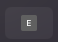
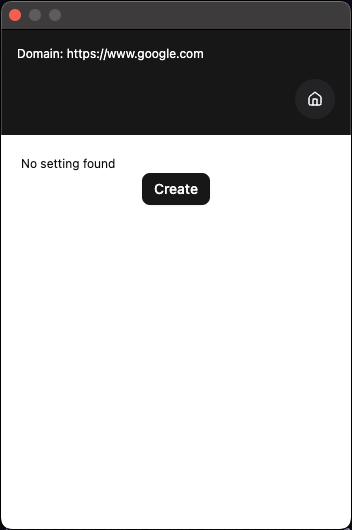
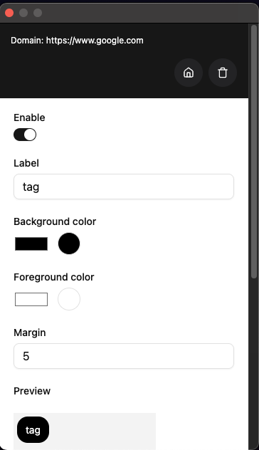
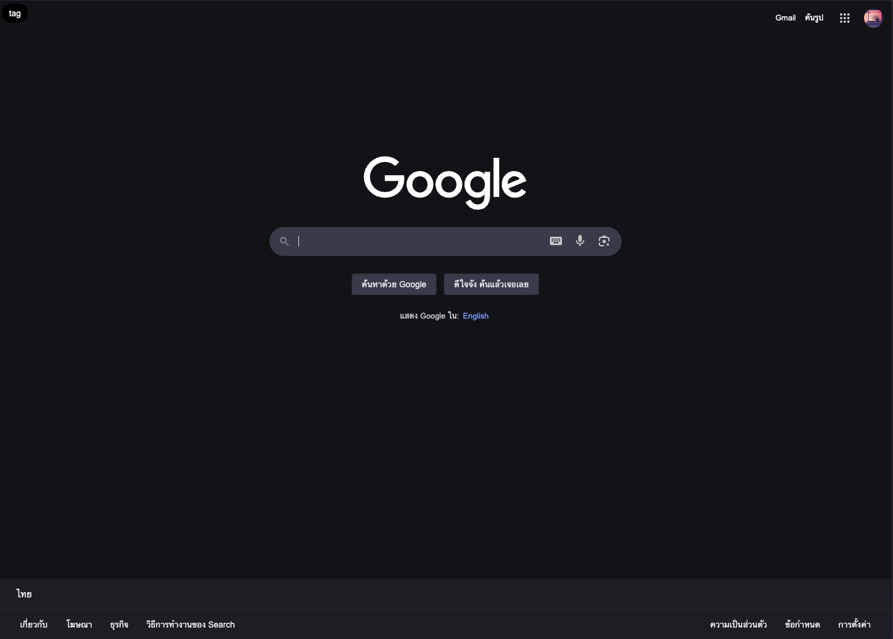

# Environment Ribbon for Chrome

A simple Chrome extension that adds a visual indicator (tag) to specified websites, helping you distinguish between different environments like **Production**, **Staging**, and **UAT**.

🎯 **Stay aware, work safely.**

---

## 🚀 Features

- Add environment-specific tags to any website
- Visually distinguish between environments (e.g. Prod, Staging, Dev)
- Customize tag text, color, and position
- Lightweight and easy to configure

---

## 🧠 Why Use This?

Working with multiple environments can lead to mistakes like:

- Accidentally editing live production data
- Confusing staging with development

This extension helps prevent that by keeping you visually informed at all times.

---

## 📦 Installation

1. Clone or download this repository
2. Build

```bash
pnpm install
pnpm build
```

3. Open Chrome and navigate to `chrome://extensions`
4. Enable **Developer mode** (top right)
5. Click **Load unpacked**, then select the dist folder inside the project directory
6. You're ready to go!

---

## ⚙️ Usage

1. Go to the website where you want to add a tag
2. Click the extension icon in the Chrome toolbar

<div style="text-align: center;">
  
</div>

3. Create a tag by clicking the Create button

<div style="text-align: center;">
  
</div>

4. Customize the tag as needed, then click the Save button

<div style="text-align: center;">
  
</div>

5. Refresh the page — the tag will now appear on the website

<div style="text-align: center;">
  
</div>

---

## 📄 License

MIT License

---
